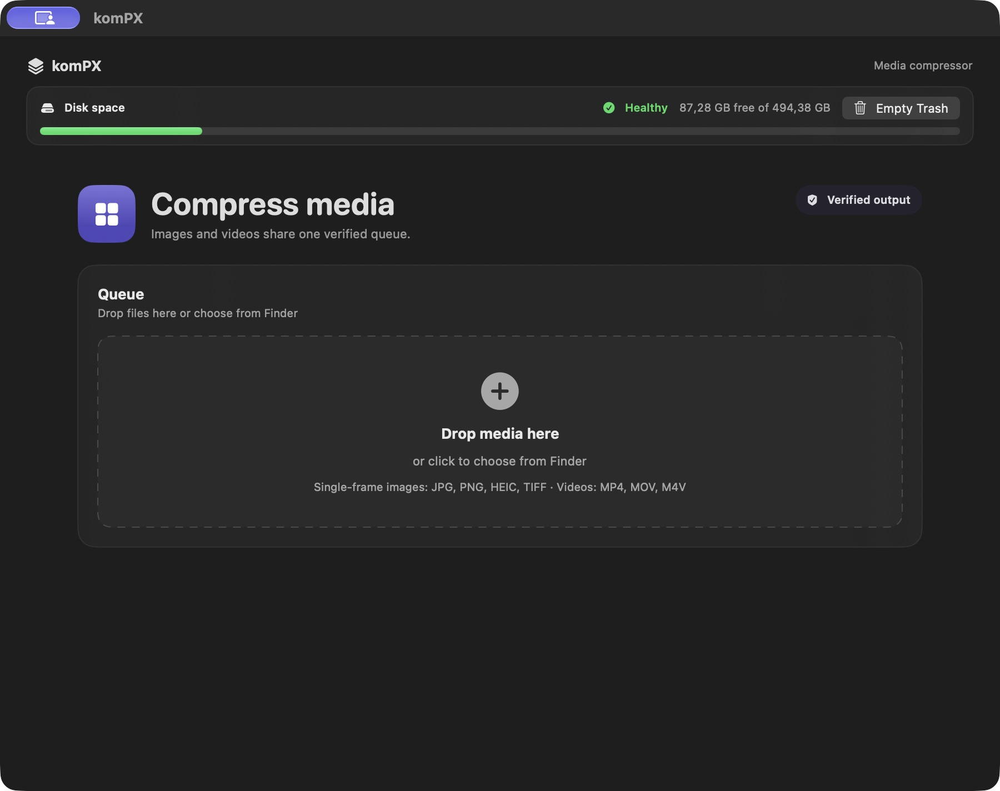

# komPX

A lightweight macOS app for compressing images and videos locally.



- Drag files or folders into one queue.
- Choose High, Balanced, or Smallest quality.
- Compress JPG, PNG, HEIC, and TIFF images; MP4, MOV, and M4V videos.
- Save smaller, verified results in place or keep originals with separate copies.
- Pause, resume, and restore unfinished work.

Requires **macOS 14 or later**. The download supports **Apple Silicon and Intel**.

## Install

Download the DMG from [Releases](https://github.com/macfreeapps/kompx/releases/latest), open it, and drag **komPX** into **Applications**.

The current release is ad-hoc signed and is not notarized by Apple. On first launch, macOS may require approval in **System Settings → Privacy & Security → Open Anyway**.

## Use

Add media, choose your settings, and click **Compress**. In same-folder mode without `_compressed`, a verified smaller result replaces the source and the original moves to Trash. Enable **Add _compressed suffix** to keep originals, or choose a custom output folder.

PNG/TIFF images are converted to HEIC when available. Multi-page images and videos with extra tracks are left untouched and reported as unsupported.

## Build

Open `komPX.xcodeproj` in Xcode, or run:

```sh
xcodebuild -project komPX.xcodeproj -scheme komPX -configuration Release \
  -derivedDataPath build ARCHS='arm64 x86_64' ONLY_ACTIVE_ARCH=NO CODE_SIGNING_ALLOWED=NO build
```

Run `scripts/smoke-test.sh` to check compression with generated fixtures (requires Xcode and FFmpeg).

Made by [@tarudesu](https://github.com/tarudesu).
